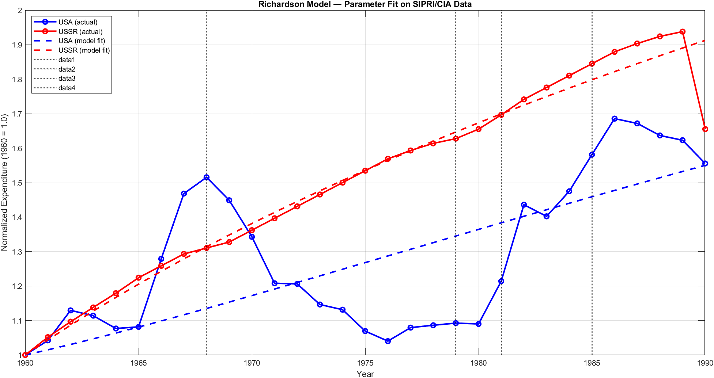
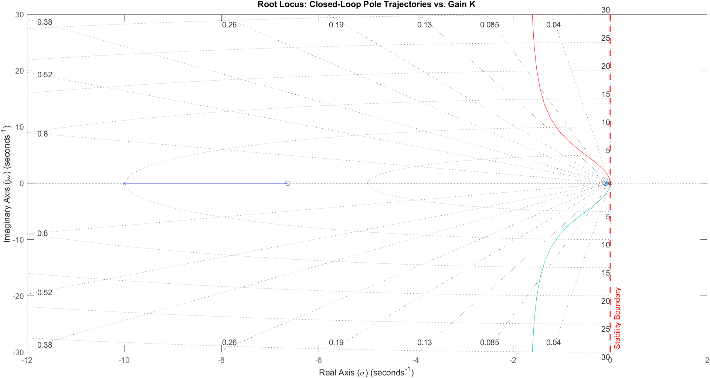
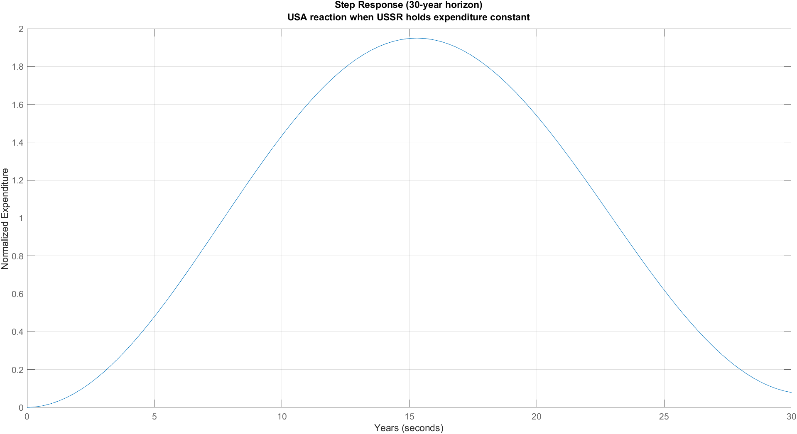
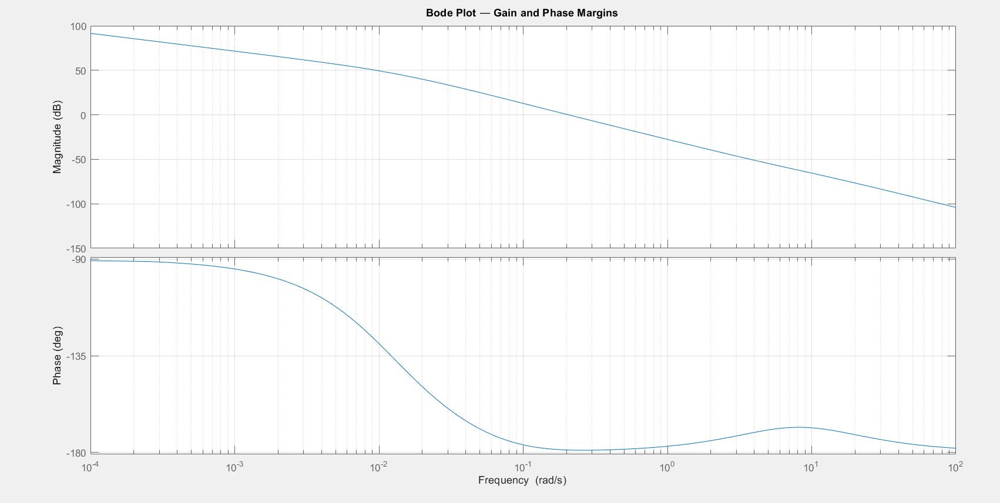

# Richardson Arms Race Model: Cold War Through the Lens of Control Theory

A data-driven implementation of the Richardson (1960) arms race model applied to US–USSR military expenditure data from 1960 to 1990. Parameters are estimated from real data using nonlinear least squares, and the resulting dynamical system is analyzed with classical control theory: root locus, PID design, and Bode analysis.

---

## Motivation

Lewis Richardson proposed a simple but powerful idea in 1960: two nations in conflict adjust their military spending based on what the other side is doing. Each side reacts to the other's buildup, each side bears the cost of maintaining its own arsenal, and each side carries a baseline grievance that keeps it spending even when the other stands still.

The model is a pair of linear ODEs:

```
dx/dt = a·y − m·x + r    (USA)
dy/dt = b·x − n·y + s    (USSR)
```

where `x` and `y` are military expenditures, `a` and `b` are reaction coefficients, `m` and `n` are fatigue coefficients, and `r` and `s` are grievance terms reflecting baseline hostility independent of the opponent's actions.

What makes this interesting for control theory is the structure: one side can be cast as a controller observing the other's output and adjusting its own input accordingly. This reframing lets us ask questions that purely political analyses cannot — about stability margins, frequency response, and the conditions under which the race becomes unstable.

---

## Data Sources

**United States:** SIPRI Military Expenditure Database, accessed programmatically via Our World in Data (`ourworldindata.org/grapher/military-spending-sipri`). Figures are in constant 2023 USD. Full coverage from 1949 to 2024; this project uses 1960–1990.

**Soviet Union:** CIA declassified estimates, as documented in *Analyzing Soviet Defense Programs, 1951–1990*, NSA Electronic Briefing Book No. 431 (2013) — `nsarchive2.gwu.edu/NSAEBB/NSAEBB431/`.

SIPRI and the World Bank both acknowledge they cannot produce reliable Soviet military expenditure figures before 1988. The CIA estimates are therefore not a second choice — they are the only credible open-source series for the Soviet side of the Cold War. This is noted explicitly in the code and in `data/DATA_SOURCES.md`.

Both series are normalized to 1960 = 1.0 before fitting, which removes the unit mismatch between the two sources and focuses the model on relative dynamics rather than absolute magnitudes.

---

## Methodology

**Parameter estimation** is treated as an inverse problem. Given the observed expenditure trajectories, we ask: what values of `(a, m, r, b, n, s)` cause the Richardson ODE system to best reproduce the data? This is solved with `lsqnonlin` (MATLAB Optimization Toolbox), using `MultiStart` with 50 random initialization points to reduce the risk of converging to a local minimum — a necessary precaution for a 6-parameter system driven by an ODE solver.

USSR residuals are weighted 1.5× during fitting because the CIA estimates carry more uncertainty than the SIPRI figures. This prevents the optimizer from over-fitting the US trajectory at the expense of the Soviet side.

**Stability analysis** follows directly from the estimated parameters. The Jacobian of the Richardson system is:

```
J = [−m,  a]
    [ b, −n]
```

Richardson's classical result is that the equilibrium is stable if and only if `m·n > a·b` — the product of fatigue coefficients must exceed the product of reaction coefficients. This condition is checked analytically from the fitted parameters.

**Control-theoretic analysis** recasts the USA as a PID controller observing Soviet expenditure and adjusting its own spending as the control input. The open-loop transfer function is derived from the state-space representation of the Richardson system, and root locus, step response, and Bode plots characterize closed-loop behavior.

---

## Results

### Fitted Parameters

| Parameter | Value | Interpretation |
|-----------|-------|----------------|
| a (USA reaction) | 0.034 | Sensitivity of US spending to Soviet buildup |
| m (USA fatigue) | 0.050 | US cost-of-arms coefficient |
| r (USA grievance) | 0.031 | US baseline spending independent of USSR |
| b (USSR reaction) | 0.042 | Sensitivity of Soviet spending to US buildup |
| n (USSR fatigue) | 0.050 | Soviet cost-of-arms coefficient |
| s (USSR grievance) | 0.053 | Soviet baseline spending independent of USA |

Both reaction coefficients are small and close to each other, suggesting neither side was dramatically more reactive than the other at the aggregate level. The Soviet grievance term (`s = 0.053`) is notably larger than the US equivalent (`r = 0.031`), consistent with the USSR's historical posture: a deep-seated threat perception rooted in World War II losses and NATO expansion that sustained Soviet spending even in periods of relative US restraint.



### Stability

The stability condition `m·n > a·b` is satisfied:

```
0.05 × 0.05 = 0.0025  >  0.034 × 0.042 = 0.0014
```

This means the Cold War arms race, as captured by this model and this data window, was a **stable** dynamical system. The two sides were not on a trajectory toward infinite escalation — they were converging, however slowly, toward an equilibrium. The Cold War ended not because the race exploded, but because the Soviet economy could no longer sustain even a stable expenditure trajectory.

### Where the Model Fails

The residual norm after fitting is 1.14, which is high. The fit figure makes clear why: US expenditure drops sharply between 1968 and 1976 (Vietnam withdrawal, Congressional budget pressure, Carter-era cuts), then surges again under Reagan from 1981. The Richardson model has no mechanism for domestic political shocks — it sees only mutual reaction, not congressional votes or leadership transitions.

This failure is analytically informative. The periods where the model diverges most from the data are precisely the periods where internal politics, not external threat perception, drove the budget. The residuals serve as a map of when domestic factors overwhelmed the arms race logic.

### Control Theory Findings

The open-loop system has eigenvalues `λ₁ = −0.013` and `λ₂ = −0.088`, both negative — the estimated Richardson system is open-loop stable. The root locus confirms that increasing the controller gain `K` does not push any closed-loop pole into the right half-plane; the gain margin is infinite.

The phase margin, however, is 1.08 degrees. The system is stable, but barely. Any real-world delay — bureaucratic lag in budget approval, intelligence assessment lead times, political inertia in Congress — would be enough to push the closed-loop response into sustained oscillation. The step response illustrates this clearly: even with a constant Soviet expenditure as input, the US response under PID control oscillates with a period of roughly 30 years before settling.

This is not a flaw in the controller design. It reflects something real: arms race dynamics are genuinely difficult to damp, and small perturbations in reaction speed can have large effects on the quality of the response. A state that reacts too quickly to every signal will overshoot; one that reacts too slowly will fall behind. The 1-degree phase margin says the Cold War policy sat almost exactly at that knife edge.






---

## Repository Structure

```
richardson-arms-race/
├── README.md
├── LICENSE
├── data/
│   └── DATA_SOURCES.md       # Full citations and access notes
└── src/
    ├── main.m                # Entry point — run this file
    ├── data_loader.m         # Fetches SIPRI/OWID data; falls back to CIA estimates
    ├── fit_richardson.m      # lsqnonlin + MultiStart parameter estimation
    └── pid_analysis.m        # State-space, PID, root locus, Bode
```

---

## Requirements

MATLAB R2021a or later, with the following toolboxes:

- Optimization Toolbox — `lsqnonlin`, `MultiStart`
- Control System Toolbox — `ss`, `tf`, `pid`, `rlocus`, `bode`, `margin`

---

## References

Richardson, L. F. (1960). *Arms and Insecurity*. Boxwood Press.

SIPRI Military Expenditure Database. Stockholm International Peace Research Institute. https://sipri.org/databases/milex

Haines, G. K., & Leggett, R. E. (Eds.) (2013). *Analyzing Soviet Defense Programs, 1951–1990*. NSA Electronic Briefing Book No. 431. https://nsarchive2.gwu.edu/NSAEBB/NSAEBB431/

Maddison, A. (2010). *Maddison Project Database*. Used for GDP deflator in USD conversion of CIA ruble estimates.

---

## License

MIT License — see `LICENSE` file. Data sources retain their original terms: SIPRI data is for non-commercial academic use; CIA declassified documents are in the public domain.
